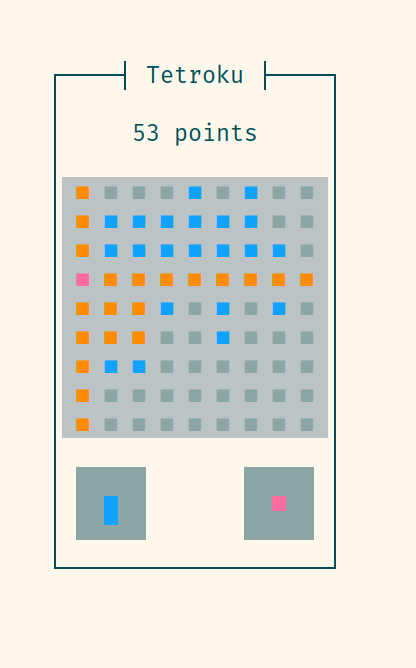

# Tetroku

A cross between Tetris and Sudoku.

You receive Tetris-like minos and place them on a 9x9 board.
Rows, columns, and squares are cleared when full.
The goal is to get as many points as possible (from placing minos, clearing features, and combos) before you can't place any of your minos.

In my implementation, minos are selected randomly and independently, but maybe a different algorithm, like one based on a bag of tiles or one based on which tiles would be "hard" to play on the current board, would make the game more fun.

## Usage

This will depend on the frontend. Currently the only implemented frontend is a TUI.

### TUI

The game starts immediately.

- To select the mino you want to place, use the number keys or click on the mino.
- To move the mino around, use the arrow keys or drag on the board with the mouse.
- To place the mino, press `Enter`.
- To restart the game, press `r`.
- To quit, press `q`, `Esc`, or `C-C`.

When using the mouse, you can "drag" a mino directly onto the board from its place in the mino menu.

The game uses colors for different states of tiles during gameplay. What these colors actually appear as will depend on your terminal configuration, but the ANSI names are used here.

- Empty tile: `dark white` (on some terminals this will be the same as the board background, while in others it will appear slightly darker)
- Filled tile: `light blue`
- Tile of the selected mino: `light cyan`
- Tile of the selected mino which conflicts with the board tile below it: `light red`
- Tile not in the mino which will be removed when the mino is placed: `light yellow`
- Tile in the mino which will be removed when the mino is placed: `light magenta`

These colors apply both to the main board and to the mino menu. Here is some clarification specifically for the mino menu:

- If a mino can't be placed anywhere on the board, all its tiles will be `light red`.
- The selected mino is highlighted with `light magenta`, because it is part of the current mino and will be removed when the mino is placed.

## License

AGPL-3.0-or-later
